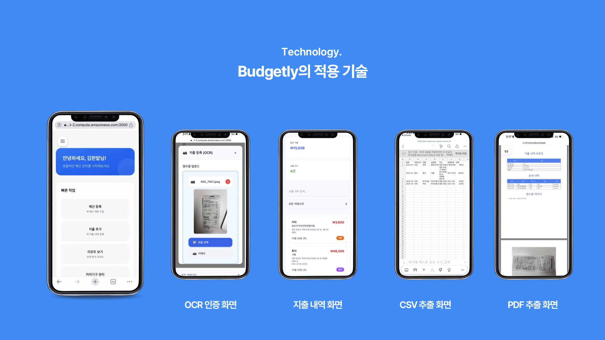
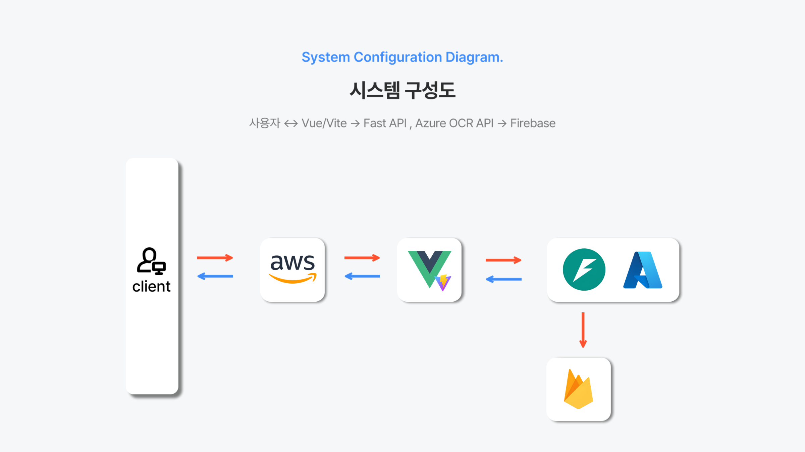

<div align="center">

# Budgetly
### OCR 기반 조직 예산 관리 시스템

<p>
  <a href="http://ec2-43-203-136-37.ap-northeast-2.compute.amazonaws.com:3000">
    
  </a>
</p>

<p>
  
  
  
  
</p>

**소중한 오픈 소스 활용SW 경진대회**

**국립한밭대학교 YEE팀**

</div>

---

## 목차
- [프로젝트 소개](#프로젝트-소개)
- [팀원 소개](#팀원-소개)
- [주요 기능](#주요-기능)
- [시스템 아키텍처](#시스템-아키텍처)
- [기술 스택](#기술-스택)
- [프로젝트 구조](#프로젝트-구조)
- [설치 및 실행](#설치-및-실행)
- [기대 효과](#기대-효과)

---

## 프로젝트 소개

### 주제
**자치기구와 학생회를 위한 예산 관리 자동화 플랫폼**

### 개요
Azure Document Intelligence OCR을 활용해 영수증을 자동 인식하고 조직 예산을 효율적으로 관리하는 Progressive Web App (PWA)

### 필요성

| 문제점 | 해결방안 |
|--------|----------|
| 수기 입력의 번거로움 | OCR 자동 인식으로 즉시 데이터 추출 |
| 실시간 예산 추적 어려움 | 실시간 대시보드로 현황 모니터링 |
| 재정 운영 투명성 부족 | 모든 지출 내역 추적 및 리포트 생성 |
| 접근성 제한 | PWA로 모바일/PC 어디서나 접근 |

---

## 팀원 소개

<table>
  <tr>
    <td align="center" width="25%">
      <br />
      <b>임동건</b><br />
      <sub>20211893</sub><br />
      <sub>컴퓨터공학과</sub><br />
      <br />
      프론트엔드 개발<br />
      배포
    </td>
    <td align="center" width="25%">
      <br />
      <b>정택준</b><br />
      <sub>20211929</sub><br />
      <sub>컴퓨터공학과</sub><br />
      <br />
      백엔드 개발<br />
      QA
    </td>
    <td align="center" width="25%">
      <br />
      <b>사민경</b><br />
      <sub>20222562</sub><br />
      <sub>컴퓨터공학과</sub><br />
      <br />
      프론트엔드 개발<br />
      기획
    </td>
    <td align="center" width="25%">
      <br />
      <b>전준</b><br />
      <sub>20237142</sub><br />
      <sub>컴퓨터공학과</sub><br />
      <br />
      백엔드 개발<br />
      QA
    </td>
  </tr>
</table>

---

## 주요 기능

<div align="center">

### Technology - Budgetly의 적용 기술



</div>

### 1. OCR 기반 영수증 자동 인식
- Azure Document Intelligence API를 활용한 영수증 이미지 자동 분석
- 날짜, 금액, 가맹점명, 주소, 전화번호 자동 추출
- 이미지 전처리 (회전 보정, 노이즈 제거, 명암 조정)
- AI 기반 자동 카테고리 분류 (9개 카테고리)
  - 식비 / 사무용품 / 회식 / 교통비 / 공과금 / 유흥 / 교육 / 의료 / 기타

### 2. 예산 관리 시스템
- 부서/조직별 예산 설정 및 관리
- 실시간 예산 집행 현황 모니터링
- 예산 대비 실제 지출 비교 분석
- 카테고리별 예산 배분 및 추적
- 예산 초과 알림 기능

### 3. 지출 내역 확인
- 카테고리별, 기간별 지출 필터링
- 상세 영수증 이미지 조회
- 지출 내역 검색 및 정렬
- 엑셀/CSV 파일 내보내기

### 4. 리포트 및 분석
- Chart.js 기반 시각화 대시보드
- 카테고리별 지출 분석 (파이 차트, 막대 그래프)
- 월별/분기별 지출 트렌드 분석
- PDF 리포트 자동 생성 및 다운로드
- 기간별 필터링 및 맞춤 리포트

### 5. PWA 기능
- Service Worker 기반 오프라인 지원
- 모바일/PC 앱 설치 가능
- 자동 업데이트 메커니즘
- 반응형 디자인 (모바일 우선)
- 푸시 알림 지원

---

## 시스템 아키텍처

<div align="center">

### System Configuration Diagram



**사용자 ↔ Vue/Vite → Fast API, Azure OCR API → Firebase**

</div>

### 데이터 흐름

```
사용자 → Vue Frontend → FastAPI Backend → Firebase Storage/Firestore
                              ↓
                    Azure Document Intelligence
```

### 주요 구성 요소

| Layer | Technology | Description |
|-------|------------|-------------|
| Frontend | Vue.js 3 + Vite | 사용자 인터페이스 및 PWA |
| Backend | FastAPI + Uvicorn | RESTful API 서버 |
| Database | Firebase Firestore | NoSQL 데이터베이스 |
| Storage | Firebase Storage | 영수증 이미지 저장소 |
| OCR | Azure Document Intelligence | 영수증 텍스트 추출 |
| Hosting | AWS EC2 + Firebase Hosting | 서버 및 정적 파일 호스팅 |

---

## 기술 스택

### Frontend


### Backend


### Database & Storage


### OCR & AI


### Deployment


---

## 프로젝트 구조

```
ossw-competition25-yee/
├── 002 Code/
│   ├── frontend/                    # Vue.js 프론트엔드
│   │   ├── src/
│   │   │   ├── components/          # Vue 컴포넌트
│   │   │   │   ├── Login.vue        # 로그인 화면
│   │   │   │   ├── Onboarding.vue   # 온보딩 화면
│   │   │   │   ├── BudgetManagement.vue   # 예산 관리
│   │   │   │   ├── ExpenseHistory.vue     # 지출 내역
│   │   │   │   ├── Reports.vue            # 리포트
│   │   │   │   ├── DepartmentManagement.vue
│   │   │   │   └── Settings.vue           # 설정
│   │   │   ├── api/                 # API 클라이언트
│   │   │   │   ├── client.js        # Axios 설정
│   │   │   │   ├── auth.js          # 인증 API
│   │   │   │   ├── budget.js        # 예산 API
│   │   │   │   ├── expense.js       # 지출 API
│   │   │   │   └── receipt.js       # 영수증 API
│   │   │   ├── services/            # 비즈니스 로직
│   │   │   ├── firebase/            # Firebase 설정
│   │   │   ├── assets/              # 정적 파일
│   │   │   ├── App.vue              # 루트 컴포넌트
│   │   │   └── main.js              # 진입점
│   │   ├── public/                  # PWA 아이콘 & 매니페스트
│   │   ├── vite.config.js           # Vite 설정
│   │   ├── tailwind.config.js       # Tailwind 설정
│   │   └── package.json
│   │
│   └── backend/                     # FastAPI 백엔드
│       ├── src/
│       │   ├── api/routes/          # API 엔드포인트
│       │   │   ├── auth.py          # 인증 라우트
│       │   │   ├── budget.py        # 예산 라우트
│       │   │   ├── expense.py       # 지출 라우트
│       │   │   ├── receipt.py       # 영수증 OCR 라우트
│       │   │   ├── department.py    # 부서 관리
│       │   │   └── admin.py         # 관리자 기능
│       │   ├── core/                # 핵심 설정
│       │   │   ├── config.py        # 환경 변수
│       │   │   └── firebase.py      # Firebase 초기화
│       │   ├── models/              # 데이터 모델
│       │   │   ├── user.py
│       │   │   ├── budget.py
│       │   │   ├── expense.py
│       │   │   └── receipt.py
│       │   ├── schemas/             # Pydantic 스키마
│       │   │   ├── user.py          # 요청/응답 검증
│       │   │   ├── budget.py
│       │   │   ├── expense.py
│       │   │   └── receipt.py
│       │   ├── services/            # 비즈니스 로직
│       │   │   ├── auth_service.py
│       │   │   ├── budget_service.py
│       │   │   ├── expense_service.py
│       │   │   ├── ocr_service.py   # Azure OCR 통합
│       │   │   ├── receipt_service.py
│       │   │   ├── category_service.py
│       │   │   ├── ai_category_service.py
│       │   │   ├── pdf_service.py   # PDF 생성
│       │   │   └── receipt_cleanup_service.py
│       │   └── utils/               # 유틸리티 함수
│       ├── main.py                  # FastAPI 앱 진입점
│       ├── requirements.txt         # Python 의존성
│       └── .env.example             # 환경 변수 예시
│
├── assets/                          # README 이미지
├── README.md
└── .gitignore
```

## 주요 기술 특징

### OCR 처리 파이프라인

```
1. 영수증 이미지 업로드
   ↓
2. Firebase Storage 저장
   ↓
3. 이미지 전처리 (OpenCV)
   - 회전 보정
   - 노이즈 제거
   - 명암 조정
   ↓
4. Azure Document Intelligence API 호출
   ↓
5. 데이터 추출 및 파싱
   - 날짜 (다양한 형식 지원)
   - 금액 (합계 자동 인식)
   - 가맹점 정보
   ↓
6. AI 기반 카테고리 자동 분류
   ↓
7. 사용자 확인 및 수정
   ↓
8. Firestore 저장
```

### 보안

- JWT 토큰 기반 인증: Access Token으로 안전한 API 호출
- Bcrypt 비밀번호 해싱: 안전한 비밀번호 저장
- Firebase 보안 규칙: 데이터베이스 접근 제어
- CORS 미들웨어: 허용된 출처만 API 접근 가능
- Pydantic 입력 검증: 모든 요청 데이터 검증

### 성능 최적화

- Vite 번들링: 빠른 빌드 및 HMR (Hot Module Replacement)
- 코드 스플리팅: 필요한 코드만 로드
- Service Worker 캐싱: 오프라인 지원 및 빠른 로딩
- 이미지 압축: OpenCV, Pillow로 이미지 최적화
- Firestore 인덱싱: 빠른 쿼리 성능
- FastAPI 비동기 처리: 동시 요청 처리

---

## 기대 효과

| 지표 | 기대 효과 |
|------|-----------|
| 업무 효율성 | OCR 자동 인식으로 수기 입력 시간 90% 단축 |
| 예산 관리 | 실시간 모니터링으로 예산 초과 30% 감소 |
| 투명성 | 모든 지출 내역 추적으로 100% 감사 가능 |
| 접근성 | PWA로 언제 어디서나 모바일/PC 접근 |

---

## 라이선스

MIT License

---

## 문의

프로젝트 관련 문의사항은 팀원에게 연락 바랍니다.

---

<div align="center">

**Made with ❤️ by YEE Team**

*국립한밭대학교 컴퓨터공학과*

</div>
